# Jedi Academy - A Star Wars Story

A Star Wars-themed Hackathon Project

## Project Description

In a galaxy far, far away, the Jedi Order stands as the guardian of peace and justice.
At the heart of the Order lies the Jedi Temple, where younglings from across the
galaxy come to begin their journey towards becoming a Jedi. You are one of these
younglings, chosen for your potential and sensitivity to the Force. Your journey will be
filled with trials that test your memory, agility, and wisdom.
What rank you acheive will be determined by how well you do in these trials.

Throughout this game, you will embark on a Star Wars themed journey with a story featuring a range of mini-games which include a memory game, Whack-a-droid, and a Star Wars themed Wordle. As you enter the Jedi temple as a youngling, you will be faced with three tasks. "The Trial of Memory", "The Trial of Agility" and "The Trial of Wisdom". Each game has its own scoring criteria. Based on your performance, you will achieve either the rank of Padawan, Jedi Knight or Jedi Master. Once all trials have been completed, you will be awarded an overall rank as you graduate from the Jedi Academy.

"May the force be with you, always!"

## User stories

Team of designers/developers:

- As a team, we want to develop user stories for the project board so that tasks are clearly defined and organized.
- As a designer, I want to create wireframes for the mini-games so that the team has a clear design reference.
- As a team, we need to source Star Wars images so that we can use them in the mini-games and storyline.
- As a team, we need to source Star Wars sound clips so that we can enhance the game's audio experience.
- As a developer, I want to implement a cohesive visual design so that the game has a consistent look and feel.

User/player:

- As a user, I want to play a Star Wars themed memory game so that I can match pairs of images.
- As a user, I can play a Whack a Droid game so that I can get the highest score possible.
- As a user, I want to play a Star Wars themed Wordle game so that I can have fun guessing words.
- As a user, I can have my data persist so that I can have a sense of story continuity in the game.
- As a user, I expect the 'How to Play' buttons on the each game to open up so I can see the instructions on how to play the game and how the game works.
- As a user, when I click on the buttons throughout the website, I expect it to take me to the relevant page or part of the application.
- As a player, I expect the games to be fully functioning without bugs so that I can play the game more easily and it is more enjoyable.
- As a user, I expect the application to be responsive so that I can view the application and play the games on all different screen sizes and so that everything can be seen clearly.

## Wireframes


<details>
<summary>Memory Game - Mobile View</summary>

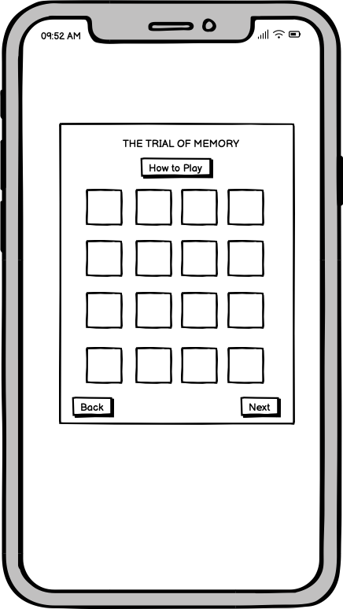
</details>

<details>
<summary>Memory Game - Tablet View</summary>

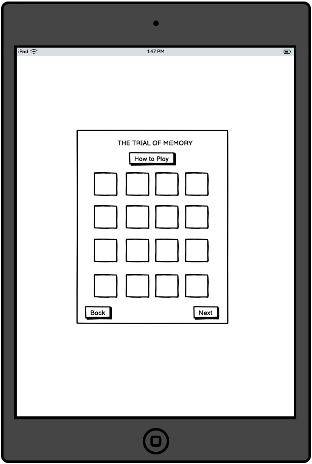
</details>

<details>
<summary>Memory Game - Laptop View</summary>

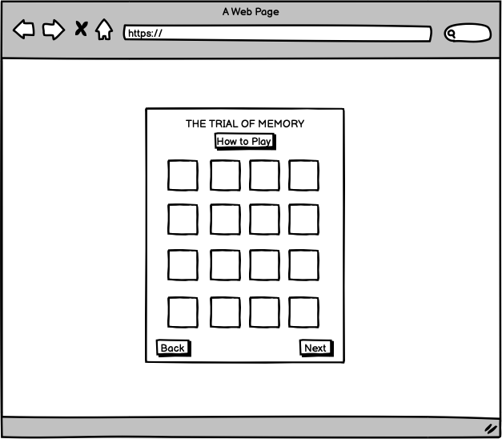
</details>

<details>
<summary>Whack a Droid Game - Mobile View</summary>

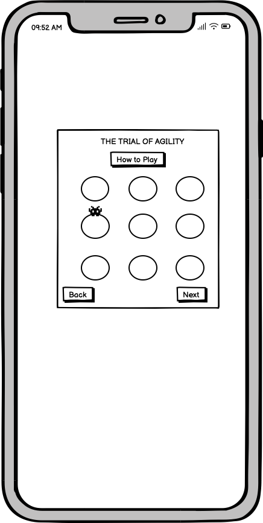
</details>

<details>
<summary>Whack a Droid Game - Tablet View</summary>

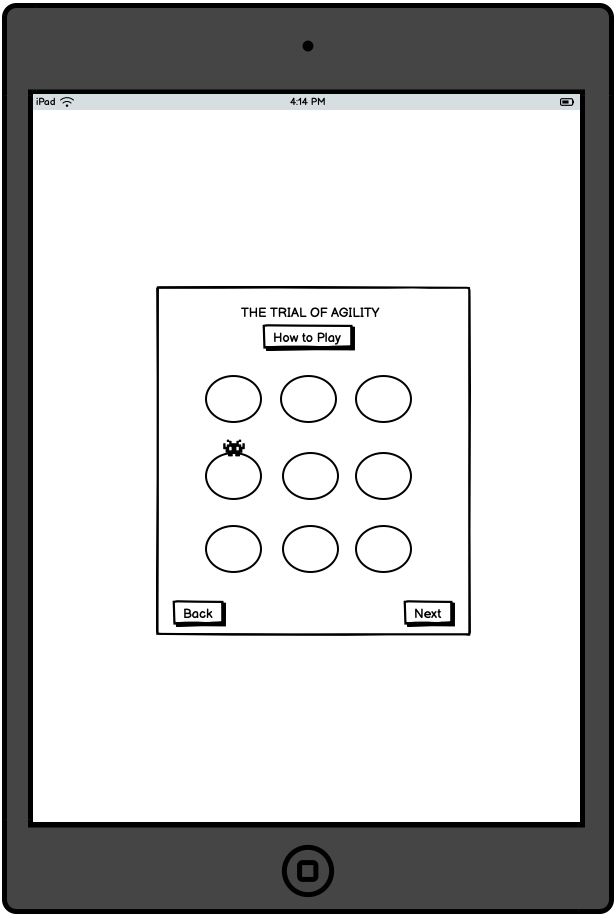
</details>

<details>
<summary>Whack a Droid Game - Laptop View</summary>


</details>

<details>
<summary>Star Wars Themed Wordle - Mobile View</summary>

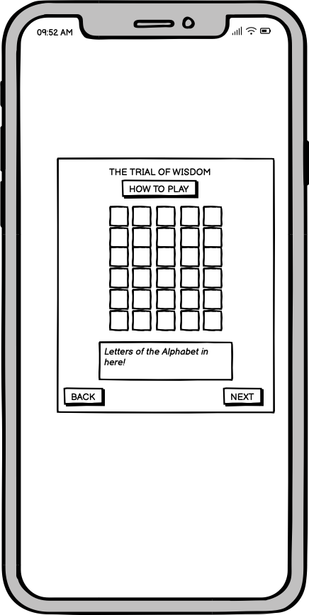
</details>

<details>
<summary>Star Wars Themed Wordle - Tablet View</summary>

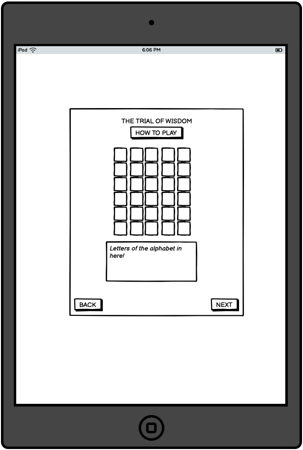
</details>

### Star Wars Themed Wordle - Laptop View

<details>
<summary>Star Wars Themed Wordle - Laptop View</summary>

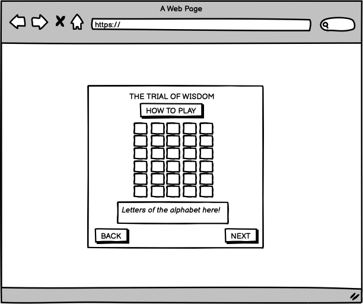
</details>

### Main Page - Mobile View

<details>
<summary>Main Page - Mobile View</summary>

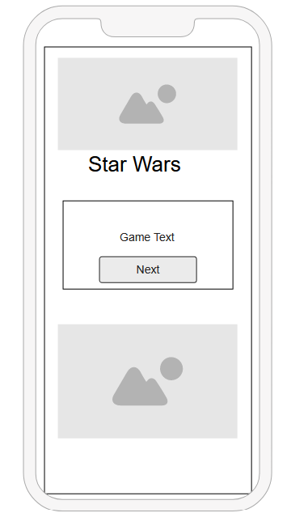
</details>

### Main Page - Tablet View

<details>
<summary>Main Page - Tablet View</summary>

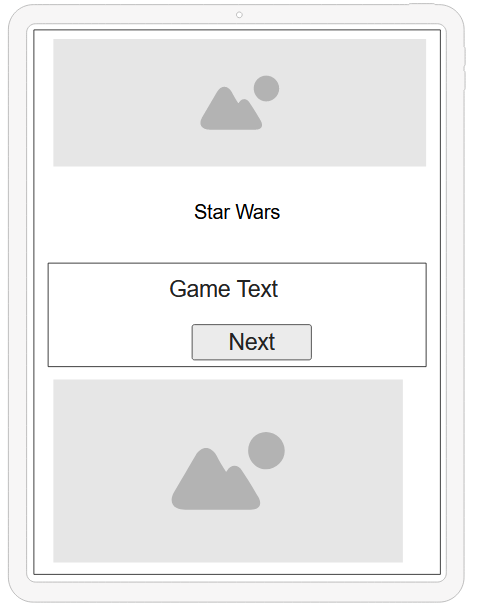
</details>

### Main Page - Laptop View

<details>
<summary>Main Page - Laptop View</summary>

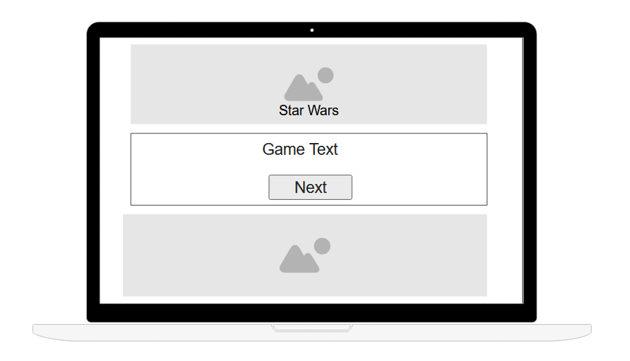
</details>

### Results Page - Mobile View

<details>
<summary>Results Page - Mobile View</summary>

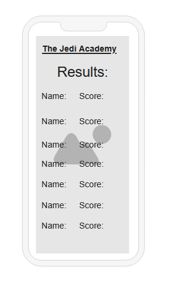
</details>

### Results Page - Tablet View

<details>
<summary>Results Page - Tablet View</summary>

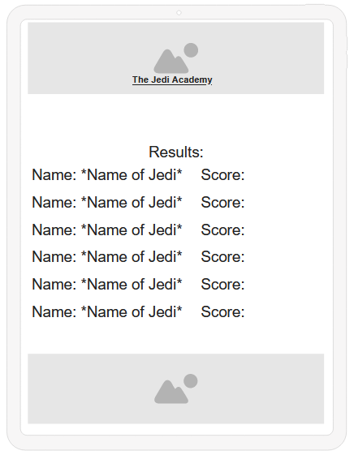
</details>

### Results Page - Laptop View

<details>
<summary>Results Page - Laptop View</summary>

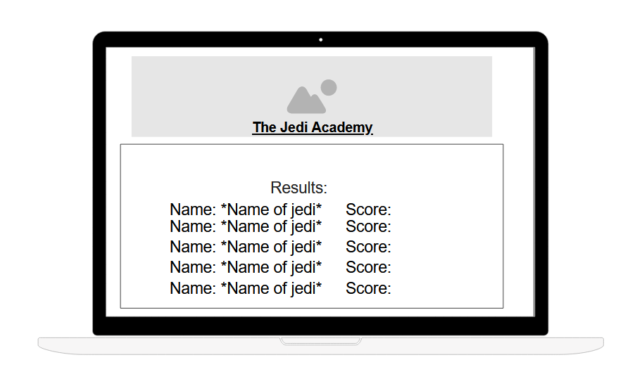
</details>

### Meet The Team Page - Mobile View

<details>
<summary>Meet The Team Page - Mobile View</summary>

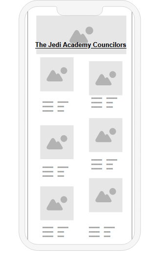
</details>

### Meet The Team Page - Tablet View

<details>
<summary>Meet The Team Page - Tablet View</summary>

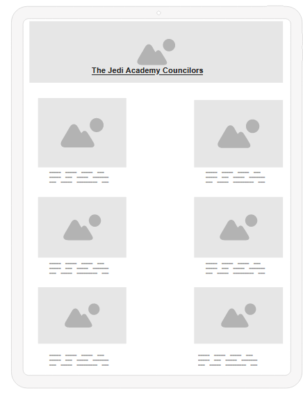
</details>

### Meet The Team Page - Laptop View

<details>
<summary>Meet The Team Page - Laptop View</summary>

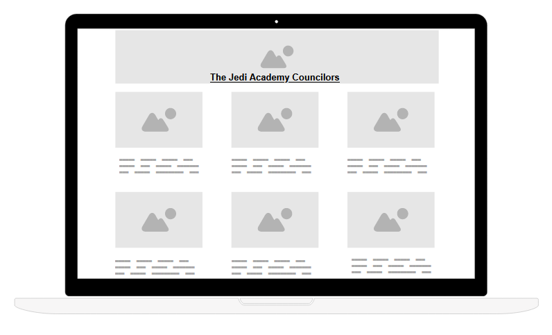
</details>

## Technologies used

*  HTML
*  CSS
*  Vanilla Javascript

## Credits

### Images

* Wordle background-image - [Wordle-background-image](https://www.pexels.com/photo/gray-and-black-galaxy-wallpaper-2150/)
* Image for whack-a-droid - [Whack-a-droid](https://pngtree.com/freepng/bb8-clipart-cartoon-star-wars-bb-vector_11054353.html)
* Image 2 for whack-a-droid  - [Whack-a-droid](https://www.deviantart.com/art-of-moore/art/Jawa-Droidsmith-310484097)
* Image 3 - [Image 3](https://www.wallpaperflare.com/)
* Sand hole image-  [Sand hole image](https://depositphotos.com/illustrations/sand-pit.html)
* Sand background- [Sand backround](https://www.freepik.com/free-photo/desert-landscape-morocco_4245806.html)
* Star Wars Logo - [Star Wars Logo](https://w7.pngwing.com/pngs/723/1016/)
* Darth Vader - png-transparent-star-wars-logo-star-wars-text-logo-silhouette-thumbnail.png
* Republic Logo - [Republic Logo](https://w7.pngwing.com/pngs/83/395/png-transparent-leia-organa-rebel-alliance-star-wars-galactic-empire-logo-star-wars-thumbnail.png)
* Jedi Logo - [Jedi Logo](https://w7.pngwing.com/pngs/429/138/png-transparent-the-new-jedi-order-star-wars-the-clone-wars-star-wars-emblem-logo-monochrome-thumbnail.png)
* Stormtrooper Logo - [Stormtrooper Logo](https://w7.pngwing.com/pngs/983/735/png-transparent-stormtrooper-illustration-stormtrooper-drawing-star-wars-stencil-stormtrooper-white-face-photography-thumbnail.png)
* Bobba-fett Logo - [Booba-fett logo](https://w7.pngwing.com/pngs/854/808/png-transparent-boba-fett-jango-fett-mandalorian-leia-organa-star-wars-death-star-angle-logo-monochrome-thumbnail.png)
* Lightsaber - [Lightsaber](https://www.pngwing.com/en/free-png-pqhkp/download)
* Jedi Temple memory game background - [Jedi Temple memory game background](https://static.wikia.nocookie.net/starwars/images/2/2d/Jedi_Temple_spires_ROTS.png/revision/latest/scale-to-width-down/1000?cb=20130215030848)
* LightSaber Favicon - [LightSaber Favicon](https://www.flaticon.com/free-icon/lightsaber_4643798?term=star+wars&page=1&position=52&origin=tag&related_id=4643798)

### Sound Clips

* Wrong choice - [Wrong choice](https://www.101soundboards.com/sounds/27903338-sadly-that-is-a-wrong-choice)
* From younglings - [From younglings](https://www.101soundboards.com/sounds/27911492-from-younglings-first-steps-to-padawans-eager-strides-the-journey-to-mastery-begins)
* Jawa Sounds = [Jaw Sounds](https://www.101soundboards.com/boards/10339-jawas-sounds-star-wars#goog_rewarded)
* R2D2 Sound - [R2D2 sounds](https://www.101soundboards.com/sounds/24263888-r2d2-text-short)

### Documentation for Code

* For the basic layout of the keyboard for Wordle we used [Wordle Keyboard](https://www.freecodecamp.org/news/build-a-wordle-clone-in-javascript/) for the keyboard.
* For help with building the Wordle game we used [Wordle Tutorial](https://www.youtube.com/watch?v=ckjRsPaWHX8)
* For documentation on [the dialog for popup buttons](https://developer.mozilla.org/en-US/docs/Web/HTML/Element/dialog)
* Some general coding documentation - [Kenny yip](https://www.kennyyipcoding.com)

### Other Documentation/content

* Wireframes - [My Moqups](https://my.moqups.com/login) and [Balsamiq](https://balsamiq.com/)
* Star Wars font - [Star Wars Font](https://www.dafont.com/star-jedi.font)

## Collaborators

### Stephen Dawson
* Github - [Github](https://www.github.com/stephendawsondev)
* LinkedIn - [LinkedIn](https://www.linkedin.com/in/sdstephendawson/)
* Stackportfol.io - [Stackportfol.io](https://www.stackportfol.io/user/stephendawson/)

### Donald MacRitchie
* Github - [Github](https://github.com/donald-macritchie)
* LinkedIn - [Linkedin](https://www.linkedin.com/in/donald-macritchie/)

### George Small
* Github - [Github](https://github.com/creepersguitar)
* LinkedIn - [LinkedIn](https://www.linkedin.com/in/george-small-055151204/)

### Hannah Olbrich
* Github - [Github](https://github.com/hannahro15)
* LinkedIn - [LinkedIn](https://www.linkedin.com/in/hannah-olbrich-0303074b/)

### Tharindu Nadeeshan
* Github - [Github](https://github.com/hpatnadeeshan)
* LinkedIn - [LinkedIn](https://www.linkedin.com/in/tharindu-nadeeshan/)

### Towbie Idowu
* Github - [Github](https://github.com/tee-24)
* LinkedIn - [LinkedIn](https://www.linkedin.com/in/towbie-idowu-18b920270/?utm_source=share&utm_campaign=share_via&utm_content=profile&utm_medium=ios_app)


## Deployment

### GitHub Pages

The project was deployed to GitHub Pages using the following steps...

1. Log in to GitHub and locate the [Github Repository for the Jedia Academy](https://github.com/stephendawsondev/jedi-academy)
2. At the top of the Repository (not top of page), locate the "Settings" Button on the menu.
3. Scroll down the Settings page until you locate the "GitHub Pages" Section.
4. Under "Source", click the dropdown called "None" and select "Main Branch".
5. The page will automatically refresh.
6. Scroll back down through the page to locate the [published site](https://stephendawsondev.github.io/jedi-academy/) in the "GitHub Pages" section.

### Forking the GitHub Repository

By forking the GitHub Repository we make a copy of the original repository on our GitHub account to view and/or make changes without affecting the original repository by using the following steps...

1. Log in to GitHub and locate the [Jedi Academy Github Repository](https://github.com/stephendawsondev/jedi-academy)
2. At the top of the Repository (not top of page) just above the "Settings" Button on the menu, locate the "Fork" Button.
3. You should now have a copy of the original repository in your GitHub account.

### Making a Local Clone

1. Log in to GitHub and locate the [Jedi Academy Github Repository](https://github.com/stephendawsondev/jedi-academy)
2. Under the repository name, click "Clone or download".
3. To clone the repository using HTTPS, under "Clone with HTTPS", copy the link.
4. Open Git Bash
5. Change the current working directory to the location where you want the cloned directory to be made.
6. Type `git clone`, and then paste the URL you copied in Step 3.

```
git clone https://github.com/stephendawsondev/jedi-academy.git
```

7. Press Enter. Your local clone will be created.
